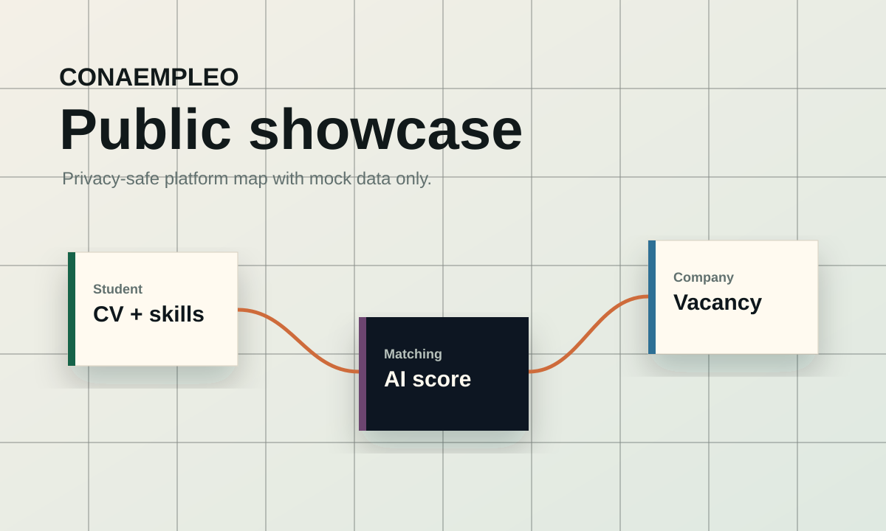

# CONAEMPLEO Showcase

CONAEMPLEO Showcase is a public, sanitized portfolio edition of an employment platform for students, graduates, companies, and school administrators.

This repository is designed to explain the product, architecture, security boundaries, and user flows without publishing private data, real credentials, internal exports, student files, company documents, or production source files.



## What This Public Edition Shows

- Student, company, and admin platform modules.
- AI-assisted employability matching concept.
- Privacy-first publication strategy for a real project.
- Mock vacancy, student, and analytics data.
- A polished bilingual web presentation for portfolio and GitHub review.
- A safety verifier that blocks obvious secrets and private data formats.

## What Is Not Included

- Real student records, company data, admin data, CVs, IDs, or uploaded documents.
- Production database dumps, CSV exports, private PDFs, backups, or media uploads.
- SMTP, database, API, or admin credentials.
- Legacy operational scripts that could mutate live access or send bulk emails.

## Run Locally

```bash
npm install
npm run check
npm run start
```

Then open:

```text
http://localhost:5188
```

Because this is a static showcase, it can also be opened directly through `index.html`.

## Repository Safety

The `tools/verify-safe-tree.js` script scans the public tree before publishing. It blocks suspicious file types and common secret patterns.

```bash
npm run check
```

For the full privacy checklist, see [docs/privacy-sanitization.md](docs/privacy-sanitization.md).

## Architecture Notes

See [docs/architecture.md](docs/architecture.md) for the platform map and public/private boundary.

## Author

Built by Alfredo Oliva as a privacy-safe public showcase for a larger employment platform concept.
