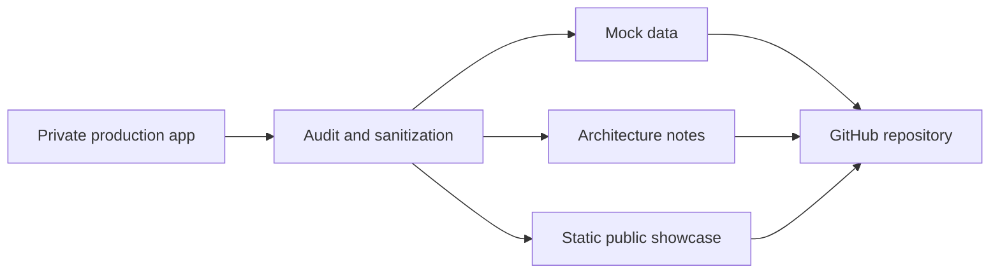

# Architecture

CONAEMPLEO is modeled as a multi-role employability platform. The private production system can contain operational logic and real records, while this repository only keeps a safe public explanation layer.

## Product Modules

| Module | Public Description | Private Data Excluded |
| --- | --- | --- |
| Student portal | Profile, CV builder, applications, and employability progress. | Student identities, CVs, documents, photos, and contact info. |
| Company portal | Vacancy publication, candidate review, and communication workflow. | Company contacts, tax files, private vacancies, and document uploads. |
| Admin portal | Verification, moderation, reports, and institutional overview. | Admin users, credentials, operational exports, and internal reports. |
| AI matching | Conceptual ranking between skills, interests, and vacancies. | Real student profiles, real vacancy history, and private scoring data. |
| Messaging | Safe communication concept between roles. | Real conversations, attachments, emails, and notifications. |

## Public Boundary

## Runtime Shape

The public edition is static by design:

- `index.html` renders the showcase.
- `src/styles.css` handles responsive layout, motion, and visual language.
- `src/app.js` powers language switching and mock data interactions.
- `examples/mock-data` stores small fake samples for documentation.
- `tools/verify-safe-tree.js` protects the public tree before commit.

This keeps the repository inspectable and safe while still communicating the product clearly.
